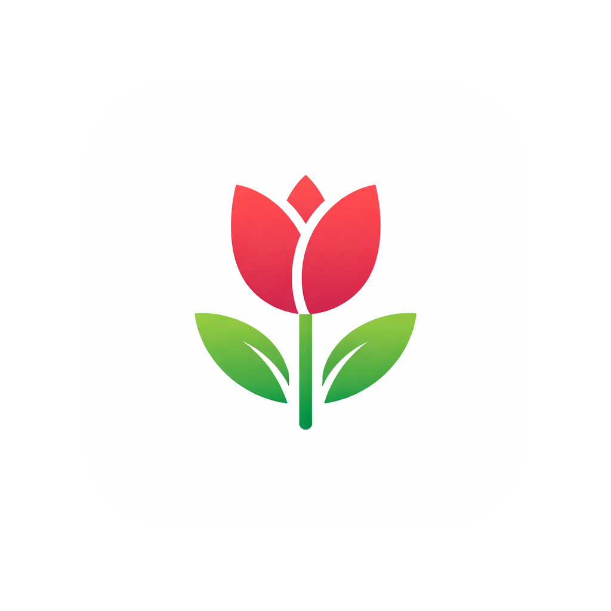

<div align="center">

[ **English**](README.md) &nbsp;·&nbsp;
[ Deutsch](README.de.md) &nbsp;·&nbsp;
[ Türkçe](README.tr.md) &nbsp;·&nbsp;
[ Italiano](README.it.md) &nbsp;·&nbsp;
[ العربية](README.ar.md)

<br/>



```
  ____      _   _
 |  _ \ ___| |_| |__  _ __ ___  _ __   ___
 | |_) / _ \ __| '_ \| '__/ _ \| '_ \ / _ \
 |  _ <  __/ |_| | | | | | (_) | | | |  __/
 |_| \_\___|\__|_| |_|_|  \___/|_| |_|\___|
```

### 👑 Long live the homescreen.

*An elegant, lightning-fast minimalist launcher for Android — built from the ground up entirely in **Jetpack Compose**. No bloat, no ads, just an extremely clean interface focused on aesthetics and speed.*

<br/>


</div>

---

## ✨ What Rethrone can do

> 🪶 **Minimalist design** — Focused on typography, whitespace and clean lines. Nothing distracts.

> 🧊 **Liquid Glass & themes** — Five elegant color themes (yellow, blue, red, green, purple), a free **color wheel** for any color you like, and the modern *Liquid Glass* effect.

> 🌗 **Dynamic contrast** — Dark and light text modes for optimal readability on any wallpaper.

> 🔤 **Full typography control** — Custom fonts, font weight and globally adjustable icon & text sizes.

> 🖼️ **Wallpaper studio** — Set a wallpaper and crop it right inside the launcher (uCrop).

> ✒️ **Custom line-art icons** — Integrated minimalist Lucide icons for a consistent look.

> 🎬 **Return animation** — High-quality, iOS-like animations that bring icons back exactly to their origin.

<details>
<summary><b>🏠 Configurable home widgets</b> — click to expand</summary>

<br/>

- **Clock, calendar (date) and weather** can each be toggled on/off individually.
- **Weather** sits in the **top-right corner** by default, just below the status bar.
- Every widget is **freely movable** via the home-screen edit mode (drag & drop).
- The clock stays **in sync** with the system time and updates exactly on the minute.

</details>

<details>
<summary><b>🎬 Granular animation control</b> — click to expand</summary>

<br/>

- A **master switch** to turn all animations on or off.
- A dedicated **"Animations" submenu** to toggle individual animation types:
  **app open**, **app close / return**, and **menus & settings menu**.

</details>

<details>
<summary><b>📂 Smart app drawer & search</b> — click to expand</summary>

<br/>

- **Niagara-style A–Z scrubber** for lightning-fast navigation through all apps.
- **Folders** with an **edit mode** to reorder apps via drag & drop.
- **Favorites list** right on the home screen — optionally with or without labels.
- **Configurable favorites outline** — choose a border style (none, black, white, accent, subtle).
- **Hybrid search** with smart suggestions.

</details>

<details>
<summary><b>🗂️ App management</b> — click to expand</summary>

<br/>

- **Uninstall apps directly** from the launcher.
- **App shortcuts** via long-press (deep links straight into app functions).
- Per-app context menu for quick actions.

</details>

<details>
<summary><b>🤙 Gestures & device actions</b> — click to expand</summary>

<br/>

- **Configurable gestures** via a dedicated **"Gestures" submenu**: freely assign an
  action to **double-tap** (and to **shake**).
- Available actions: **app drawer**, **search**, **lock screen**, **notifications**,
  **flashlight**, **camera**, **do not disturb**, **open a specific app**, **settings**.
- **Swipe gestures:** swipe up for the app drawer, swipe down for the notification shade.
- **Notification integration** on the home screen.

</details>

> ℹ️ **Info section** — Transparent access to app version, licenses and developer information.

---

## 🛠 Tech stack

| | |
|---|---|
| 🟣 **Language** | Kotlin `2.2.10` |
| 🎨 **UI framework** | Jetpack Compose (BOM `2024.09.00`) |
| 🧱 **Design** | Material 3 components |
| 🏗️ **Build** | Android Gradle Plugin `9.2.1` |
| ✒️ **Icons** | [Lucide Icons](https://lucide.dev/) `1.1.0` |
| ✂️ **Image cropping** | [uCrop](https://github.com/Yalantis/uCrop) `2.2.8` |
| 📱 **SDK** | compile/target `36` · min `26` |
| 🔍 **Linter** | [detekt](https://detekt.dev/) `1.23.8` |
| 📊 **Coverage** | [Kover](https://github.com/Kotlin/kotlinx-kover) `0.9.8` |

---

## 👥 Developers

| 🧑‍💻 | |
|---|---|
| **Refik Bilal Batmaz** | |
| **Vinisan Kunasegaran** | |

---

## 📄 License

This project is under a **Custom Non-Commercial License**.

- ✅ **Allowed:** Free use and installation of the APK for private purposes. Viewing and modifying the source code for private purposes.
- ❌ **Forbidden:** Any commercial use, sale, paid distribution or monetization (e.g. ads).

---

## 📁 Project structure

```text
.
├── app                      # 👑 Main application module
│   ├── src
│   │   ├── main
│   │   │   ├── java         # Kotlin source code
│   │   │   │   └── com.example.androidlauncher
│   │   │   │       ├── data       # Data models & managers (AppInfo, FolderManager, ThemeManager …)
│   │   │   │       ├── ui         # Compose UI components (AppDrawer, menus, wallpaper crop …)
│   │   │   │       │   └── theme  # Design system (colors, typography)
│   │   │   │       ├── *Service   # Notification & accessibility services, shake/return logic
│   │   │   │       └── MainActivity.kt  # Entry point & navigation
│   │   │   └── res          # Android resources (icons, strings, XML)
│   │   └── test             # JVM unit tests
│   └── build.gradle.kts     # Module-specific Gradle configuration
├── config                   # Configuration files
│   └── detekt               # Detekt (linter) configuration
├── gradle                   # Gradle wrapper and version catalog
│   └── libs.versions.toml   # Central dependency management (version catalog)
├── build.gradle.kts         # Project-wide Gradle configuration
├── settings.gradle.kts      # Project settings & included modules
└── README.md                # You are here 👋
```

---

## 🚀 Development

### 🧰 Requirements
- Android Studio (current stable version)
- JDK 17
- Gradle wrapper/daemon also on JDK 17

### 🔨 Build the project
```bash
./gradlew assembleDebug
```

### ▶️ Install the debug app (default)
```bash
./gradlew run        # alias for :app:installDebug
```

### ⚡ Test the release app — fast & over Wi-Fi

The release build runs with R8/minify and without `debuggable` overhead, so it is **noticeably faster** than debug. It is signed with the debug keystore → installable over Wi-Fi and as an in-place update *next to* the debug build (no uninstall needed).

```bash
# 1) Connect your phone via Wi-Fi debugging (Android 11+)
#    Codes from: Developer options → Wireless debugging → Pair device with pairing code
adb pair    <phone-ip>:<pair-port> <pairing-code>
adb connect <phone-ip>:<debug-port>
adb devices                                   # device should be listed

# 2) Build & install release
./gradlew installRelease

# 3) Launch the launcher (or just press the home button)
adb shell am start -n com.example.androidlauncher/.MainActivity
```

> 💡 Because ProGuard/R8 is active, click through the whole app once after a release build. If a class is missing at runtime, add a matching `-keep` rule in `app/proguard-rules.pro`.

### 🧪 Run tests
```bash
./gradlew :app:testDebugUnitTest
```

### 📊 Generate coverage
```bash
./gradlew koverXmlReportDebug koverLogDebug
```

### ✅ Verify the coverage gate
```bash
./gradlew koverVerifyDebug
```

### 🔍 Run the linter
```bash
./gradlew detekt              # check (CI gate)
./gradlew detekt --auto-correct   # auto-format locally
```

### 🏛 Architecture
See [`ARCHITECTURE.md`](ARCHITECTURE.md) for the layering, state-management conventions,
and a guide for adding features the intended way.

---

## 🩺 Troubleshooting

- `./gradlew clean build` succeeds even if `stripDebugDebugSymbols`/`stripReleaseDebugSymbols` reports that certain `.so` files cannot be stripped. In this context these are only warnings.
- If `./gradlew clean run` previously aborted with `Task 'run' not found`: the root `run` task now exists as an alias for `:app:installDebug`.
- Always use the wrapper (`./gradlew`) instead of `gradle`, so the version pinned in `gradle/wrapper/gradle-wrapper.properties` is used.
- The `HAPTIC_FEEDBACK_ENABLED` warning in `ThemeManager.kt` is a deprecation warning and not a build blocker.
- The many AGP deprecation `WARNING`s during `installRelease` are harmless — as long as `BUILD SUCCESSFUL` appears, everything is fine.
- For detailed plugin/Gradle warnings:
```bash
./gradlew --warning-mode all help
```

---

## 🤖 CI (GitHub Actions)

- **`android.yml`** — runs on **push to `main`** and on **pull requests to `main` / `develop`**. Includes Detekt lint, unit tests and a coverage summary in the Actions tab.
- **`release.yml`** — separate workflow around release artifacts.

<div align="center">

<br/>

*Made with 🪷 & Jetpack Compose.*

</div>
